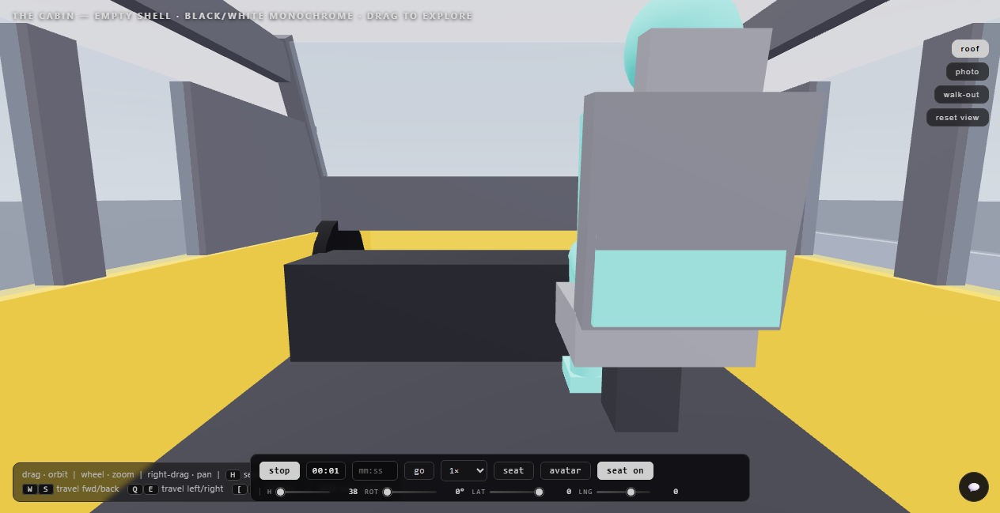

# cabin-agent-sim

A tiny learning project: a **cognitive agent with a persona** sits down
inside an **automated car interior** — movable seat, head-up display,
vending machine, no steering wheel, a foldable table — and plays with it,
step by step, for a short session. At the end the persona answers a
standardized **trust questionnaire** (the MDMT).

The intuition you can test here: give the same cabin to different
personas and watch their behaviour and their trust answers change.
Editing a persona is editing one JSON file — the agent code stays the same.

**The mind is Python; the browser only watches.** `cabin_sim/cognition.py`
owns state and the body; the pages poll a versioned snapshot and
forward input back. A real LLM (Groq free tier by default) is the
**reasoner**: each beat it examines the real outcome of its last action,
reconsiders from its persona and picks the next move *with its own values*
— which seat axis, how far, or to just sit — while Python only
whitelists the vocabulary and clamps to physical travel. Chat is
interpreted by the model too (questions get answers, orders get carried
out). With no LLM configured the deterministic rules the test suite pins
take over, and a failed call merely makes that beat quiet — a run never
breaks.

## Preview



Current 3D scene (`src/cabin.js`): framed SUV greenhouse with A/B/C
pillars, raked windscreen, yellow skirt with grey hood/deck, turquoise
avatar that walks in and sits, and a seat clamped inside the cabin with
its knees clear of the dash. Drag to orbit, `[C]` to walk outside,
`W/S/Q/E` to travel.

## Web app (Vite + three.js)

The interactive cabin runs as a **Vite web app at the repo root**
(`index.html` + `src/`), using `three` from npm — no vendored copy.
It contains the drawn empty shell, the seat wired live to the dock
(`S.rot` deg / `S.sl` cm / `S.hgt` cm), and the roaming avatar.

Single-seat adjustment limits (drawn rig, clamped):

| adjustment | range | default | control |
|---|---|---|---|
| seatback recline | 10–40° | 24° | `[` `]` keys · recline rail in the seat card |
| slide (fore-aft) | ±8 cm | 0 cm | `A` `D` · dock slide rail |
| seat height | 38–46 cm | 38 cm | `↑` `↓` · dock height rail |
| rotation (yaw) | 0–360° | 0° | `←` `→` · dial |

Empty black-and-white monochrome interior (interior-only, same scene +
animate loop): neutral black shell + charcoal trim with off-white Ivory
seats, armrests and door inserts — black · grey · off-white, no colour.
Sculpted surfaces only: dashboard with vents and a chrome brow line; low
center console with shifter (portrait screen + cluster powered OFF/blank);
door cards with ivory armrests and metal pulls; three-spoke wheel and seat
(10–40° recline). The GTS red survives only as a thin hairline pinstripe
on the roofline. No occupant fixtures — freshly-delivered and empty.

```bash
npm install          # once — vite + three
npm run dev          # local dev server → http://127.0.0.1:5173
npm run build        # production bundle → dist/
npm run preview      # serve the built bundle locally
```

Module map:

```
index.html          Vite entry — scene stage, seat dock, chips, summary,
                    trust survey, 💬 experimenter chat (async → POST /api/chat)
src/main.js         boot order: cabin → avatar → cognitive → ui
src/cabin.js        3D scene: empty black/white monochrome interior (sculpted dash, low
                    console, door cards, 3-spoke wheel; blank screen + cluster, powered
                    off, no occupant fixtures), seat (+seatRig/agentMount/recline
                    hinge), lights, orbit controls; exports cabinApi {scene, camera,
                    controls, renderer, seatRig, agentMount, seatMount, state}
src/avatar.js       roaming drawn agent — sits on the seat, walks the cabin
src/cognitive.js    the VIEW adapter: polls /api/snapshot every 700 ms, draws the
                    HUD + live 2D dock, forwards seat input; publishes __COG_LIVE__,
                    __SEAT_LIVE__ and __EXPERIMENTER_CHAT__ — it decides nothing
src/cognitive.legacy.js  the pre-port JS mind, archived unchanged (reference)
src/ui.js           aggregation: mirrors the avatar pose onto __CABIN3D__.avatarPose
public/             interior refs (interior.jpg / interior-alt.jpg) + live sim
                    captures (sim-live-web.png / sim-live-view.png)
```

`cabin_sim/` + `web/` serve the same sim **without npm**: a stdlib HTTP
server on `:8000` that also renders an inline-SVG visual. The
authoritative loop lives entirely in Python; `cabin_sim/MIGRATION.md`
documents the JS → Python port.

## How it works

**Agent loop (BDI, one decision per step):**

1. **Perceive** — reads the cabin state and its own mood (comfort, energy, suspicion).
2. **Reason** — with `--reasoning auto` (the default when the provider is
   `groq`/`ollama`) one LLM call runs the whole loop: it **examines the
   real outcome** of its previous action (as asked, clamped at a travel
   limit, or refused), **reconsiders** from its persona, and proposes the
   next action **with its own values** — which axis, how far, or nothing
   at all. Experimenter chat enters the same loop: the model interprets a
   question, small talk, or an order (standing until it reports it done).
   `--reasoning rules` uses the deterministic desire-argmax and phrase
   banks only — that is what the test suite runs on.
3. **Validate** — the proposed action is checked against the vocabulary
   whitelist and every number against the cabin's physical travel limits;
   the real result (including any clamp or refusal) is fed back for the
   next reason step to examine.
4. **Act + narrate** — the action is applied, mood updates, and the persona's words show in the browser.

With no LLM configured the deterministic rules answer every tick; bad
JSON, a `429`, or a dead network simply make that beat **quiet** — the
ride keeps ticking (and pytest stays green).

**Trust questionnaire** — at the end of the session the persona rates the
automated cabin on the 16-item MDMT:

| Subscale | Items |
| --- | --- |
| Reliable | reliable, predictable, someone you can count on, consistent |
| Capable | capable, skilled, competent, meticulous |
| Ethical | ethical, respectable, principled, has integrity |
| Sincere | sincere, genuine, candid, authentic |

Each item 0 (not at all) to 7 (very), with an optional "Does Not Fit"
(treated as missing). Subscale score = mean; **Capacity trust** =
mean(Reliable, Capable), **Moral trust** = mean(Ethical, Sincere).

## Quick start

```bash
python -m venv .venv
.venv\Scripts\activate            # Windows (macOS/Linux: source .venv/bin/activate)
pip install -r requirements.txt

python -m cabin_sim.main --provider groq    # mind + view → http://127.0.0.1:8000
```

The session runs 5 minutes (`--duration 300`), ticking a decision every
1.2 s (`--interval`). Open the URL and watch the persona iterate.

Prefer the three.js cabin? In a second terminal:

```bash
npm install          # once — vite + three
npm run dev          # http://127.0.0.1:5173, proxies /api → :8000
```

Headless run (no browser) for quick checks:

```bash
python -m cabin_sim.main --headless --steps 40
```

## Using a real LLM (free + fast)

Edit `.env` (copy from `.env.example`):

```ini
# Free cloud brain — ~300 ms/call, ~30 req/min, no credit card
LLM_PROVIDER=groq
GROQ_API_KEY=your_key             # free at console.groq.com
GROQ_MODEL=allam-2-7b

# OR fully local, no key (offline fallback)
LLM_PROVIDER=ollama
OLLAMA_MODEL=qwen3:4b
OLLAMA_THINK=0                    # Qwen3 hidden thinking: 19 s/call → 0.75 s off
```

Provider is picked from `--provider`, then `.env` (the template ships
`scripted` so a fresh clone runs silent — flip two lines to go live).
Unknown or missing config never breaks a run. The reasoning mode is
separate (`--reasoning auto|rules|llm`); deliberation is throttled to fit
Groq's free tier (~6K TPM) and every failure falls back to rules for that
tick. Optional `CHAT_MODEL` splits lanes: chat on one model, ticks on
another (`--chat-model` on the CLI).

## Chat with the persona

The 💬 panel (and `POST /api/chat`) sends your line to the **live mind** —
asynchronously, so the page never freezes while the model thinks (a `…`
shows until Phill answers; if the mind is down the panel says so instead
of faking a reply). Routing matches his thoughts: seat words act on his
body, trust words answer from the live trust score, everything else goes
to the model. The console hook keeps its legacy shape:

```js
window.__EXPERIMENTER_CHAT__.send("Do you trust this car?")   // → {ok, reply, state}
window.__EXPERIMENTER_CHAT__.history()                        // [{who, t, text}] oldest first
```

## Personas

`personas/phill.json` ships as the first persona: *Phill, 33, entry-level
officer from Aachen, married, no kids, weekend commute, first time in a
highly automated interior.* Introvert, suspicious, confident, uninterested
in the car — he wants a functional neutral seat and to get somewhere.

A persona file holds: name, background story, traits, preferred seat
settings + tolerance, starting mood (energy, suspicion), vending interest
and curiosity. Copy the file, change the numbers and the story, and run
`python -m cabin_sim.main --persona personas/you.json` to try it out.

## Project layout

```
cabin_sim/
  cognition.py       the Mind (authoritative): perceive → LLM cycle
                     (examine → reconsider → act) or rules BDI, mood/
                     trust/memory, chat, the safety bridge — pure Python
  reasoning.py       LLM lanes: decide (the closed loop), speech,
                     chat_act (order interpretation), outcome feedback,
                     free-tier throttle, quiet-beat fallback
  provider.py        groq | ollama | scripted backends (think/token caps)
  sim.py             SimEngine — the only clock: phases, ride script, priors
  schema.py          build_snapshot — the single JSON contract for the views
  server.py          stdlib HTTP: / · /api/state · /api/snapshot · /api/chat
                     · /api/seat · /api/control + the ticker thread
  session.py         1 session = engine + mind + event log + questionnaire
  world.py           car interior: Seat + VendingMachine + Table (pure state)
  actions.py         the agent's action whitelist; every change is clamped
  agent.py           act layer: validate + apply, counts succeeded/blocked
  questionnaire.py   MDMT (16 items, 4 subscales, scoring)
  main.py            CLI (--provider · --reasoning · --chat-model · ...)
  MIGRATION.md       JS → Python port notes
web/index.html       inline-SVG visual served on :8000 (polls /api/state)
src/                 three.js view adapter + archived pre-port mind
tests/               pytest suite — 100 tests
personas/            editable persona JSON files
tutorial-cognitive.html         architecture tutorial (kiosk, 8 sections)
tutorial-cognitive-python.html  companion walkthrough
public/              interior reference photos + live sim captures
```

## Tests & tutorials

```bash
python -m pytest tests -q     # 100 passed
npm run build                 # exit 0
```

`tutorial-cognitive.html` is the guided tour of the architecture —
8 collapsible sections covering the BDI overview, data structures, the
cognition loop, memory, trust & mood, the event timeline, the API hooks
and the key parameters. Open it directly in a browser (double-click).
Live screenshots of the running sim ship in `public/sim-live-*.png`.

## References

- Ullman, D., & Malle, B. F. (2019). Measuring gains and losses in
  human-robot trust: Evidence for differentiable components of trust.
  In *Proceedings of the 14th ACM/IEEE International Conference on
  Human-Robot Interaction (HRI '19)*, 618–619. https://doi.org/10.1145/3319502.3374821
- Malle, B. F., & Ullman, D. (2021). A multidimensional conception and
  measure of human-robot trust. In *Trust in Human-Robot Interaction*
  (pp. 3–25). Academic Press. https://doi.org/10.1016/B978-0-12-819472-0.00001-0
- Ullman, D., & Malle, B. F. (2018). What does it mean to trust a robot?
  Steps toward a multidimensional measure of trust. In *Companion of the
  ACM/IEEE International Conference on Human-Robot Interaction (HRI '18)*,
  263–264. https://doi.org/10.1145/3173386.3176991
  (Source of the scale items: https://research.clps.brown.edu/SocCogSci/Measures)
